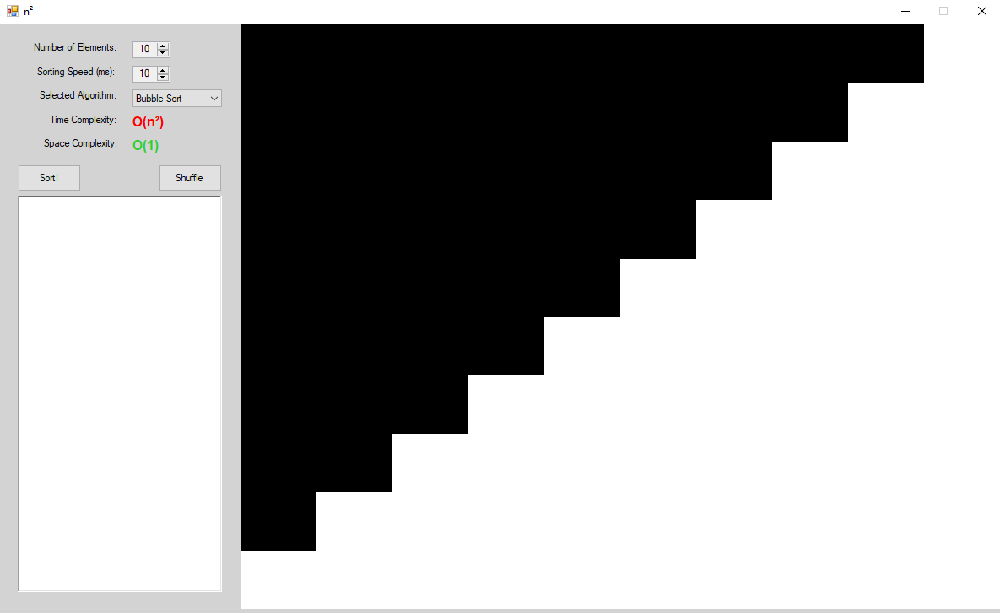

<!-- TABLE OF CONTENTS -->
## Table of Contents

* [What is N_Squared?](#what-is-n_squared)
* [Built With](#built-with)
* [Installation](#installation)
* [Usage](#usage)


<!-- ABOUT THE PROJECT -->
## What is N_Squared? 
N_Squared is a Winforms application written using C# that visually represents various sorting algorithms (bubble sort, merge sort, insertion sort, etc.). It was originally developed as a learning tool to develop a better understanding of SYDE 223 course concepts. The image below is a preview of the application:




### Built With
This application was built in a Windows environment using Visual Studio and .Net Framework.


### Installation

1. If you haven't already installed Visual Studio, you can download it for free [here](https://visualstudio.microsoft.com/downloads)
2. Clone the repository using your method of choice; I typically use Git Bash.
```
git clone https://github.com/loganseu/N_Squared.git
```
3. Open the solution, and simply run the application by clicking "Start". You may do this in either debug or release mode.

<!-- USAGE EXAMPLES -->
## Usage

Play around with any of the settings; You're free to change sorting speeds, the number of sorting elements, the algorithm, etc.
